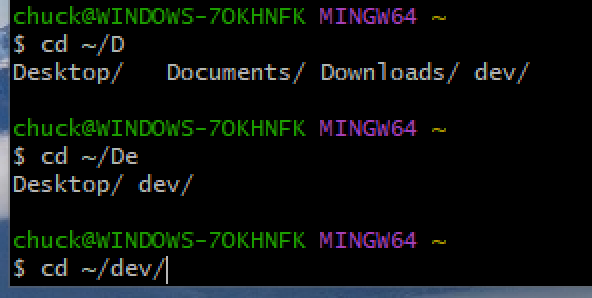
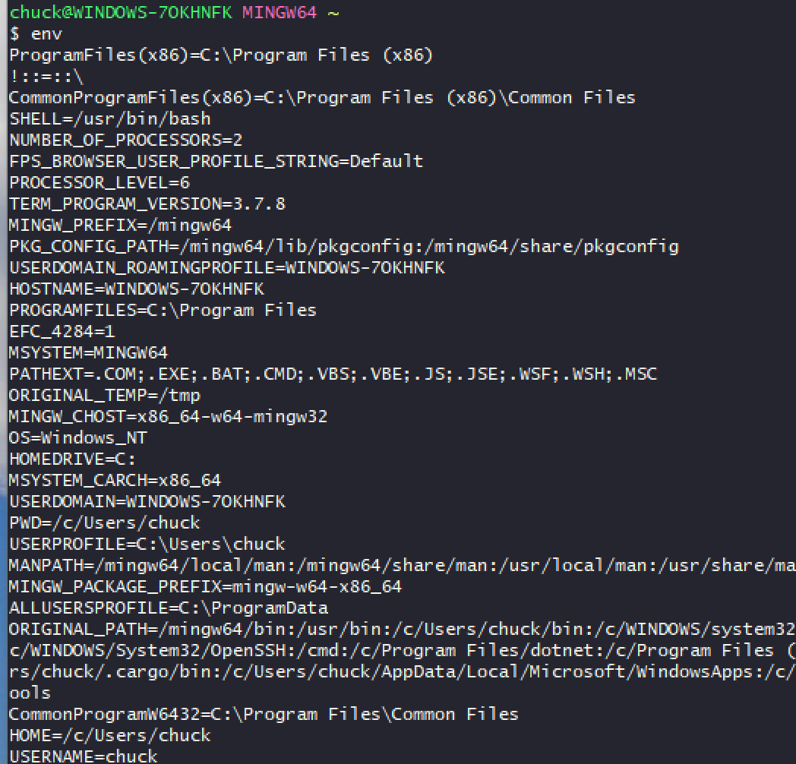
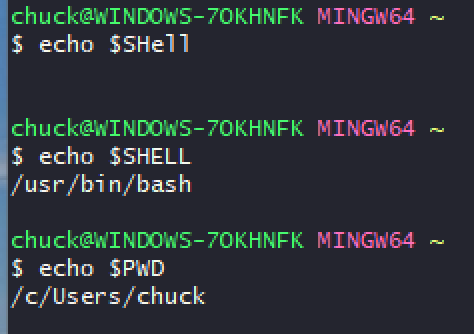
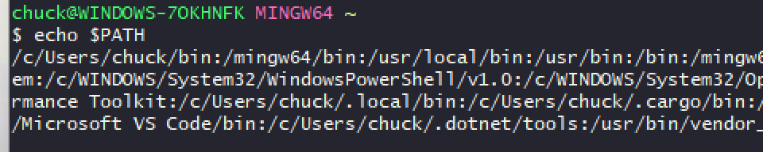
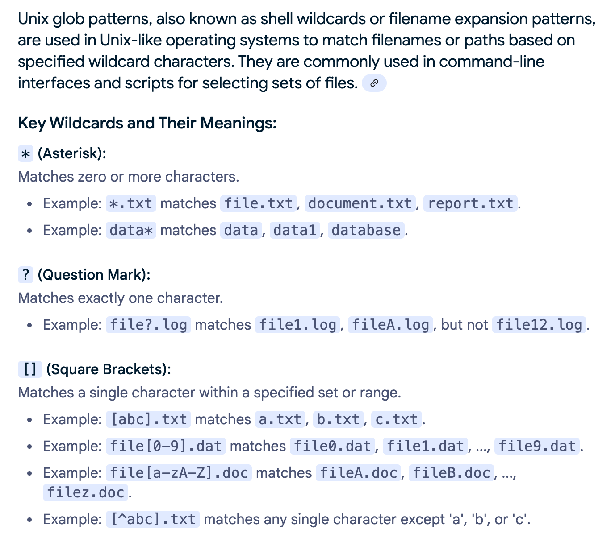
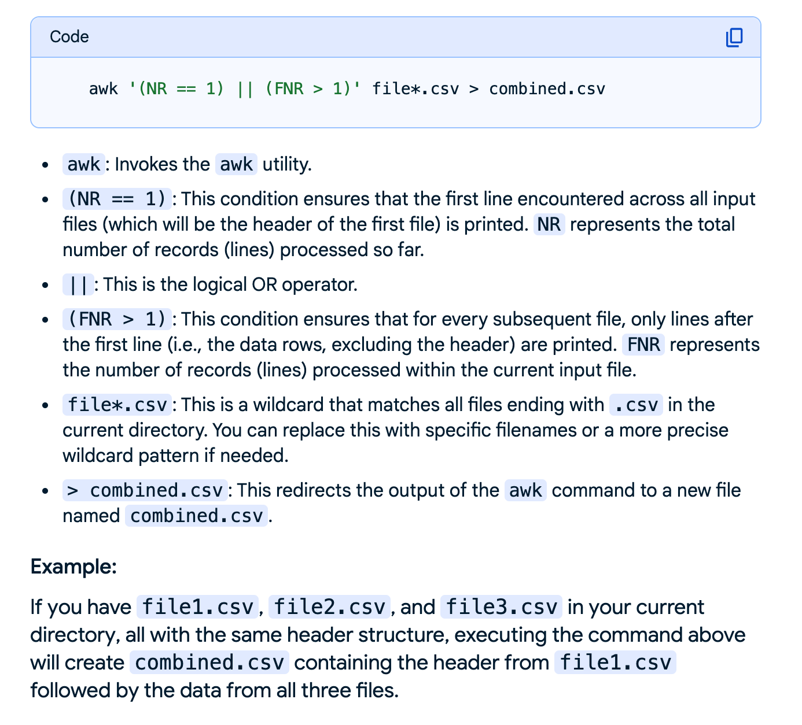
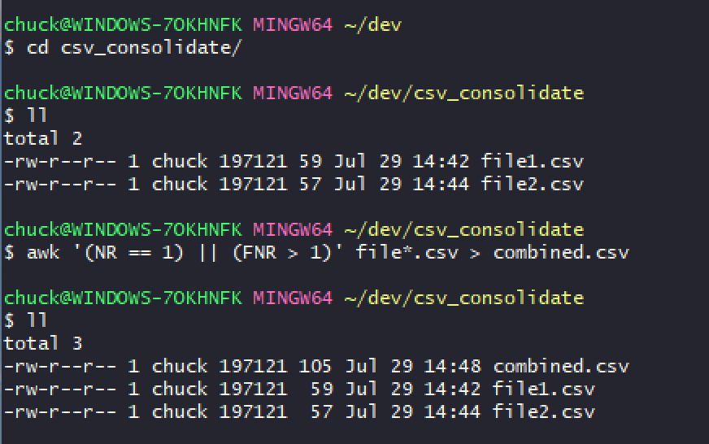
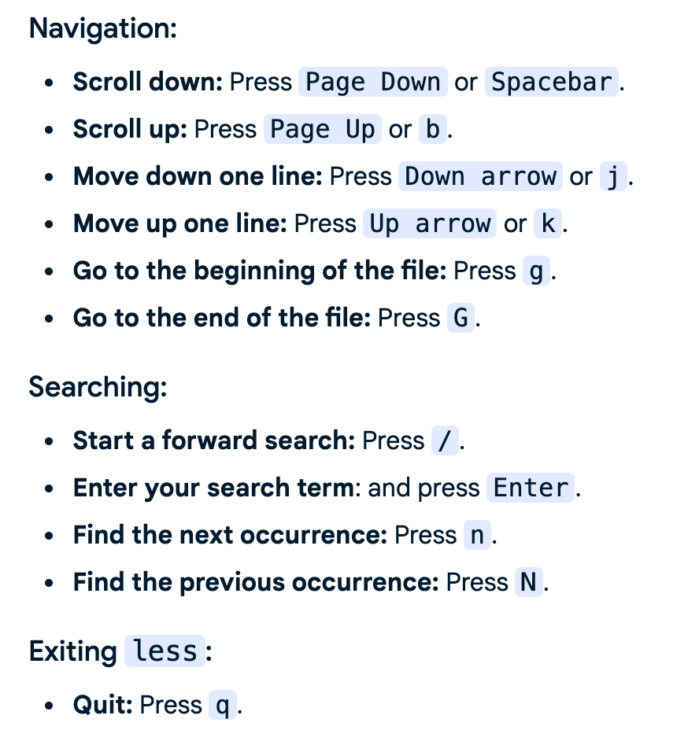
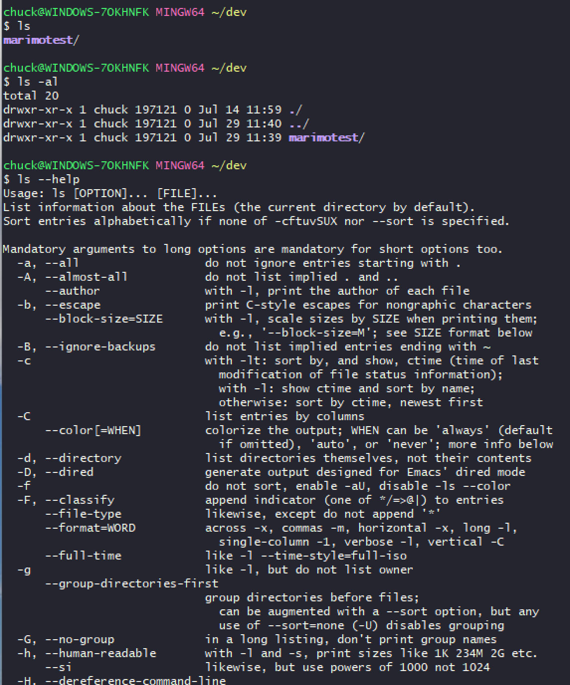
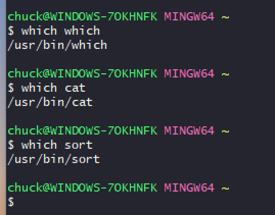

# Unix Command Intro for Windows Folks

Just a little unix command intro for some family members that have always used only windows.

## First Things First

- Watch this video: https://www.youtube.com/watch?v=yoZ910JQzrg
- Install Git Bash on your Windows system
- When installing, select the option to add a desktop Git Bash icon
- Installer: https://gitforwindows.org/

## Git is a Version Control System

But we aren't starting there. We're just using it because they provide a nice Bash (Born Again Shell) Unix command line emulator for Windows.

If you want to learn about Git:

- https://git-scm.com/docs
- https://git-scm.com/docs/gittutorial
- https://www.youtube.com/watch?v=zTjRZNkhiEU

You'll want to learn about GitHub as well.

- https://en.wikipedia.org/wiki/GitHub
- https://docs.github.com/en/get-started/using-github/github-flow

And, if you actually want to code, you'll want some kind of code editor:

- Visual Studio Code: https://www.youtube.com/watch?v=cu_ykIfBprI&t=33s

And, if you are going to code, you can't go wrong starting with Python:

- Python Getting Started Video Series: https://www.youtube.com/watch?v=jGE4aLSgRDs&list=PL2iGGYc-iqtyVjCXzFCSH1yggyUDOEpSL

## Using the Git Bash Environment

### Fixing the Tiny Screen Size

Open a Git Bash terminal, drag the corners out to the size you normally want to use, right click on the title bar, click on Options, choose Window, choose Current size, and Save. Note: there are other settings in Options that you might want to explore, like Options>Looks>Theme.

### Enabling Copy/Paste Within the Git Bash Terminal

You can't use Control-C for copy in Git Bash because Unix shells use Control-C to send a signal to a process to tell it to shut down. So, some other keys must be used.

You can enable Ctrl+Shift+C and Ctrl+Shift+V for a more familiar copy-pasting experience within Git Bash:

- Right-click on the top bar of the Git Bash window.
- Select "Options".
- Go to the "Keys" section.
- Check the box for "Ctrl+Shift+letter shortcuts".
- Click "Apply" and then "Save".
  - To Copy: Ctrl + Shift + C
  - To Paste: Ctrl + Shift + V

### Using Git Bash for Git/GitHub (Advanced - not needed for this effort)

https://www.geeksforgeeks.org/git/working-on-git-bash/

## Now for Some Unix

### Good Quick-Intro Vidoes

For a super quick intro to get you started, please watch this video: https://www.youtube.com/watch?v=sw9kdFka8rA

And even though some of the material is repeated in this video, please watch this one also because you will see some clearer explanations of some of the commands and some new stuff. This video also references using nano, which is a command-line code editor that is simpler-to-learn (than vim) for beginners. Nano is installed with Git Bash. https://www.youtube.com/watch?v=S0XegNhpTs8&t=17s

That video just above references explainshell.com, which is rather cool and useful, and will attempt to show you what a particular sheel command means: https://explainshell.com/. If you have a shell command example that you are confused about, give that web page a try by pasting it in there.

### Some Background on Unix

#### Do One Thing Well

Unix was built using a few philosophies: it stores configs and text and such in text (not binary) files; internally it treats many of its parts as files or file-like objects; it has a bunch of commands that “do one thing well”.

#### Auto-Connect to Standard Interfaces

When you open a unix terminal, it automatically opens three “file like” (stream) interfaces: standard input (“stdin”), standard output (“stdout”), and standard error (“stderr”). And, it (normally) automatically connects these to hardware devices on your computer.

    - stdin: Keyboard
    - stdout: Display
    - stderr: Display

https://en.wikipedia.org/wiki/Standard_streams#/media/File:Stdstreams-notitle.svg

#### Programs vs Commands vs Arguments

Unix uses lots of programs. These are typically compiled software that is invoked at the shell command line. However, the shell also has a bunch of built in commands. The shell takes care of finding the command when you run it on the shell terminal. If the command is not a built-in command, the shell will look in your execution path to see if it can find the program that you called. If it doesn't, it'll complain that you provided an unknown program (command not found). If it does, it'll invoke the program and pass it the arguments you provided on the shell.

So, for example, when you type `head -5 ./myfile.txt`, the shell will invoke the head program and pass it the "-5 ./myfile.txt" arguments. Head must be programmed with code that will process the arguments and determine how to use them. You can figure out what head wants for arguments by running `head --help`. Most Unix programs will accept either a `-h` or `--help` argument to get it to print out its help info to the display.

By the way, you actually might have a program that installed that the shell can't find because the program was installed somewhere that is not listed in the directories listed in your path.

#### Redirects and Pipes

“Stdout” and “stderr” are both connected to your display, which seems odd at first, but they do that so that you can send expected data and unexpected data to different places if/when you want.

To make that possible, they have ways of telling unix to redirect those outputs to a different place. Since the tools are built to do one thing, the way you do most things is to pipe the output stream of one tool into the input stream of the next tool. When the terminal/shell sees that a tool/program is in what they call a pipeline, it doesn’t connect the program to your display but sends it into a “pipe” that is like a water pipe where one tool pumps its output into the pipe and the next tool reads its input data from the pipe.

A good thing about pipes is that they can queue up some amount of data so a fast tool doesn’t overload a slower tool downstream. When the entire pipeline ends, the shell closes all the programs and destroys the temporary pipes.

A pipe is represented by a vertical slash “|”. So, this pipeline reads the data from a file and sends it through a pipe into the sort program, which sorts the input data and sends it into a different pipe into a program (head) that grabs the top 5 rows: `cat my_file.txt | sort | head -5`.

The output of head, since it isn’t redirected into a pipe, gets sent to stdout and displayed on your terminal screen. If you wanted to send that instead to a file, you could run this `cat my_file.txt | sort | head -5 > a_new_file.txt`, which would do the same thing, but send the final output stream of text data into a new file in your present working directory (`pwd`). That “>” file redirection symbol always overwrites the file so if there was one already there, you loose it’s contents and get the new contents. If you want to keep the old and new contents, you can use a different redirection symbol for appending data to a file “>>”, like so: `cat my_file.txt | sort | head -5 >> appended_file.txt`.

#### Home Folder

Unix environments use the tilde symbol as a mapping to your home folder. So, instead of having to type out your home folder path, you can just type "~" and the rest of the path you desire. For example, instead of `cat c/users/myusername/dev/myfile.txt` you can type `cat ~/dev/myfile.txt`.

#### Tab Completion

Unix shells normally offer command line tab completion. This means you can start typing what you want and hit the tab key and if the shell can figure out what you are trying to do, it will finish filling in the command. This is most often used with directory and file names. So, if you are trying to type in a long file name, you can start the name and then hit tab and if there are no conflicting file names, the tab completion with fill in the rest of the name. Typically, if there is a name conflict, the shell will show you the conflicting names and you can type one/more additional characters as needed to identify the desired name.



#### History

Unix shells keep a short history of commands you employ to make it easier to reuse them later without typing so much. Typically, this will be between 1,000 and 10,000 lines. You can look through the history by being at the terminal and using the up and down arrows. When you find a previous command you want, you can change it using the left and right arrow keys, and then run it, or just hit return to run it as is.

The history info is normally stored in a hidden file called .bash_history.

#### Environment Variables

Unix commands often take advantage of environment variables. These are variables that get set a variety of ways but get presented to the shell when it runs. You can see what environment variables are set for your shell by running the `env` command.



If you only want to see the value of a particular environment variable, you can grab just that one by prefixing it with a dollar sign and calling it with `echo`, for example `echo $SHELL`.



Perhaps one you will actually use sometimes is: `echo $PATH`.



#### Path

Unix finds programs by searching in the directories listed in your PATH environment variable. The path is a list of directories separated by a colon. Unix will look for the program in each directory, and here's the important part, starting at the first directory and keeping going until it finds the program or not. So, if you have a copy of (possibly different versions) a program in the first path directory and another copy in the last path directory, the shell will use the one in the first directory. Or, said another way, it'll use the first one it finds.

#### Glob

Unix allows you to use wildcard patterns to match multiple files, letters, etc. Here are the common patterns.



### Some Commands

#### alias

The alias command can be used to configure shortcut commands that basically just call something else. They are typically used to provide an easier way to call a command with options or provide a provide a shorter way to call long command strings. Aliases get loaded in when you open the shell. You can see which aliases are currently loaded by calling the alias command.


If you want to add an alias that will show a long listing that includes hidden files, you can run this command on the terminal `echo 'alias lla="ls -al"' >> ~/.bashrc`. This will append the line to your config file, but you will need to restart your terminal for it to become active (cause the terminal to reread the configs). If that scares you, you can add `alias lla="ls -al"` as a new line to .bashrc using nano.

By the way, I'm not sure how Git Bash on Windows is including those aliases that come with the terminal as they are not in .bashrc. So, just add what you want as custom aliases to .bashrc.

Tip: You can use custom aliases to save yourself a lot of typing. For example, let's say you work in a specific folder a lot and are tired of typing cd blah blah. You could create yourself a custom alias and then just use that by adding this line to .bashrc `alias mar="cd ~/dev/marimotest/;git pull"`. Then, you can restart the terminal and just type mar return and whalaa! That alias above changes to the marimotest directory and then invokes the git pull command (that dir is a git repo) and pulls down any new files automatically, so you are always working with the current repo files without worrying about forgetting to do a git pull. Don't worry about this if you are not using git. Some folks have 10-20 custom aliases they always set up on a new system.

#### awk

You can do some wild and crazy text processing using the awk command. However, awk use can be rather complicated even for an experienced user. But, sometimes you can do stuff with awk that would take writing your own script to get done.

For example, here's how to use awk to consolidate a bunch of CSV files with headers into one file with a quick and simple awk run.



Here's an example of the use of the awk command shown above.



And the command in case you want to copy/paste it: `awk '(NR == 1) || (FNR > 1)' file*.csv > combined.csv`.

#### less

Unix offers several choices of programs you can use as a pager, which is a program to page through the contents of a large file. Without a pager, the contents of a large file will just blow through the terminal and you will only be able to see the last part of the content. The pager I recommend is `less`.

You can use `less` to load text files directly, or you can pipe the contents from some other command into it.

For example:

```
cat ./somelong.csv | sort | less
```

Or:

```
less ./somelong.csv
```

Here's a good intro video on using less: https://www.youtube.com/watch?v=06GsFVeuWNk&t=175s

Most used navigation keys:

<p align="center">

</p>

#### ls/ll

These were covered in the videos you were supposed to watch, but as a reminder, you can list the files and directories in a folder using the ls command or any aliases that are set up. By default, ls gives a short listing but you can give it options to change how it works.



#### which

You can use the which command to find out where a program is installed, or, if there are more than one copies of it, which one will get executed. Sometimes a different version that what you expected with get executed because it came first in the list of directories listed in your path.


