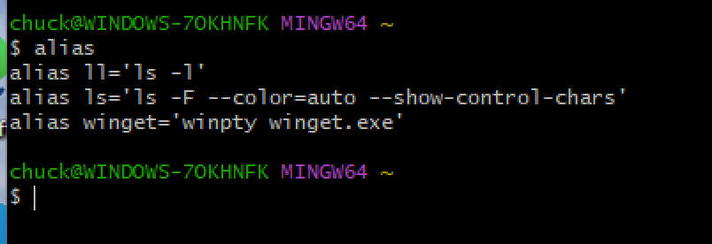

# Unix Command Intro for Windows Folks

Just a little unix command intro for some family members that have always used only windows.

## First Things First

- Watch this video: https://www.youtube.com/watch?v=yoZ910JQzrg
- Install Git Bash on your Windows system
- When installing, select the option to add a desktop Git Bash icon
- Installer: https://gitforwindows.org/

## Git is a Version Control System

But we aren't starting there. We're just using it because they provide a nice Bash (Born Again Shell) Unix command line emulator for Windows. If you want to learn about Git:

- https://git-scm.com/docs
- https://git-scm.com/docs/gittutorial
- https://www.youtube.com/watch?v=zTjRZNkhiEU

And, you'll want to learn about GitHub as well.

- https://en.wikipedia.org/wiki/GitHub
- https://docs.github.com/en/get-started/using-github/github-flow

And, if you actually want to code, you'll want some kind of code editor:

- Visual Studio Code: https://www.youtube.com/watch?v=cu_ykIfBprI&t=33s

And, if you are going to code, you can't go wrong starting with Python:

- Python Getting Started Video Series: https://www.youtube.com/watch?v=jGE4aLSgRDs&list=PL2iGGYc-iqtyVjCXzFCSH1yggyUDOEpSL

## Now for Some Unix

For a super quick intro to get you started, please watch this video: https://www.youtube.com/watch?v=sw9kdFka8rA

And even though some of the material is repeated in this video, please watch this one also because you will see some clearer explanations of some of the commands and some new stuff. This video also references using nano, which is a simpler-to-learn for beginners code editor. Nano is available with Git Bash. https://www.youtube.com/watch?v=S0XegNhpTs8&t=17s

That video just above references explainshell.com, which is rather cool and useful: https://explainshell.com/

### Some Background on Unix

Unix was built using a few philosophies: it stores configs and text and such in text files; internally it treats many of its parts as files or file-like items; it has a bunch of commands that “do one thing well”.

When you open a unix terminal, it automatically opens three “file like” (stream) interfaces: standard input (“stdin”), standard output (“stdout”), and standard error (“stderr”). And, it (normally) automatically connects these to hardware devices on your computer.
https://en.wikipedia.org/wiki/Standard_streams#/media/File:Stdstreams-notitle.svg

### Some Commands

#### alias

The alias command can be used to configure shortcut commands that basically just call something else. They are typically used to provide an easier way to call a command with options or provide a provide a shorter way to call long command strings. Aliases get loaded in when you open the shell. You can see which aliases are currently loaded by calling the alias command.

#### ls/ll

## Using Git Bash for Git/GitHub

https://www.geeksforgeeks.org/git/working-on-git-bash/
